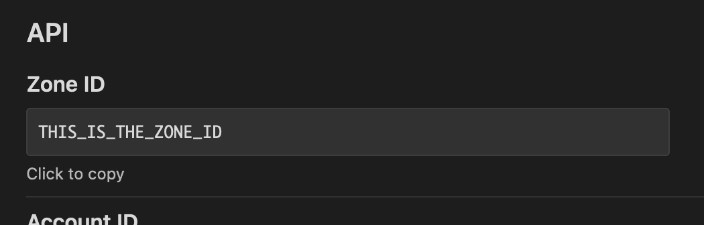
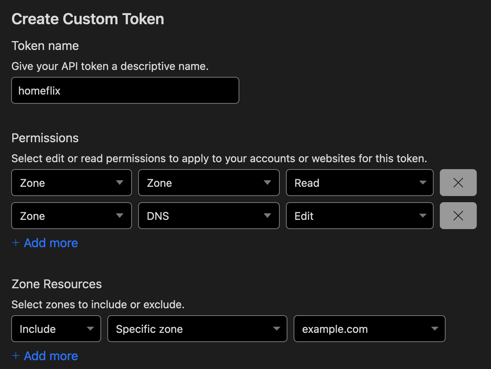

## Needed environment variables

### `CLOUDFLARE_ZONE_ID`

Go to the zone overview in the Dashboard and copy the zone ID from the sidebar

### `CLOUDFLARE_DOMAIN`

The domain that should be updated, e.g. `flix.example.com`

### `CLOUDFLARE_API_TOKEN`

Create a token (https://dash.cloudflare.com/profile/api-tokens) with permissions to edit Zone.DNS

